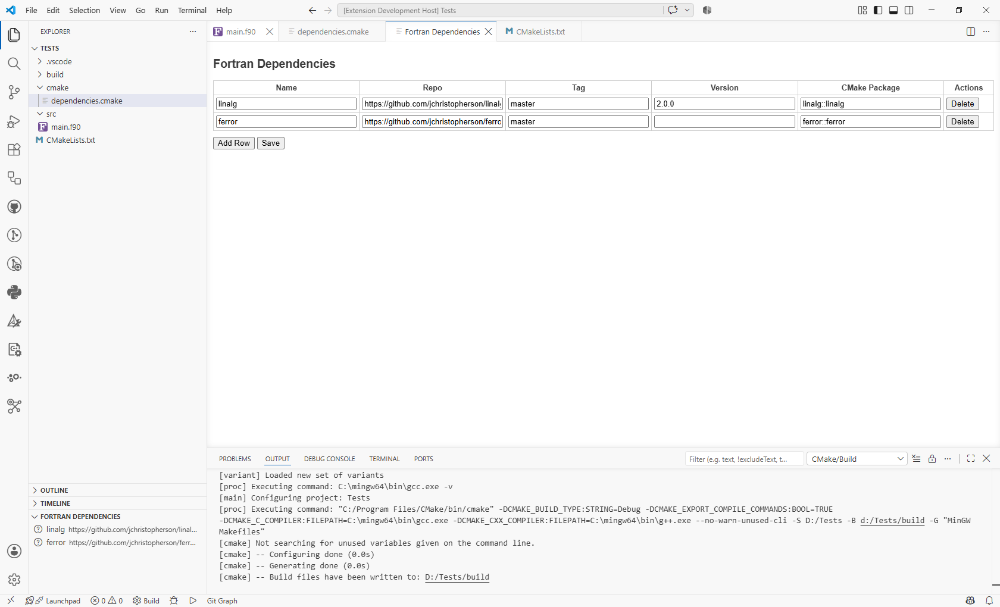
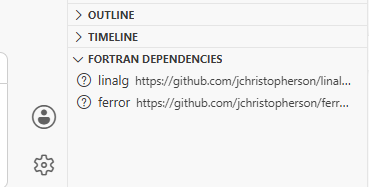
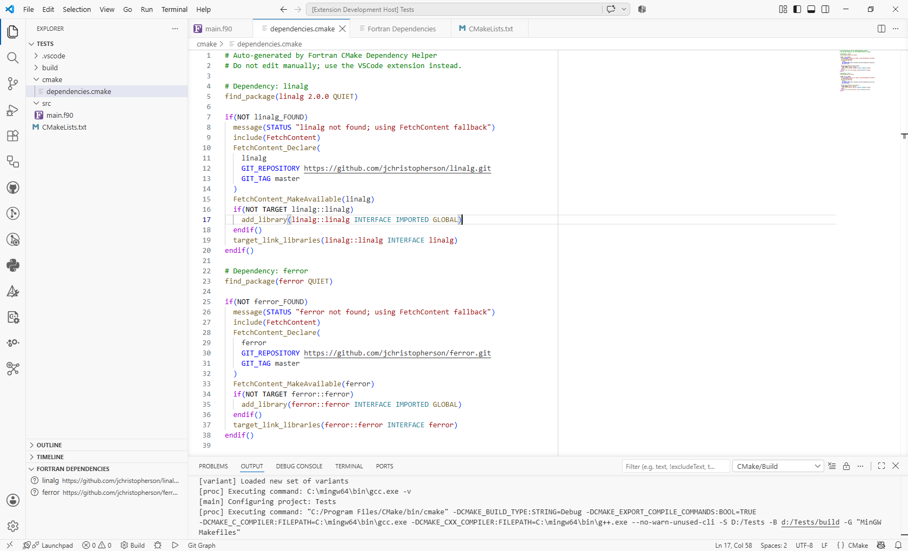
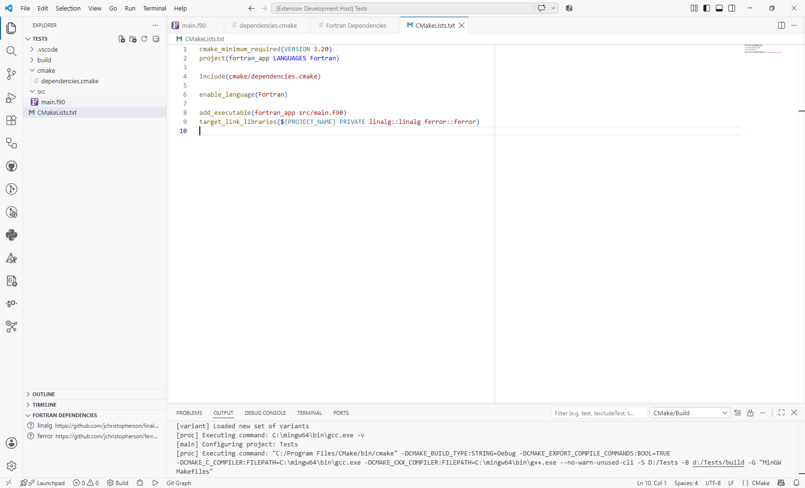

# Fortran CMake Dependency Helper

A VSCode extension that:

- Scaffolds a Fortran + CMake project (with `main.f90` entry point).
- Lets you add GitHub-based dependencies by name + URL.
- Uses `find_package` first, then falls back to `FetchContent` if needed.
- Generates and maintains `cmake/dependencies.cmake`.
- Runs CMake to validate dependencies and shows status in a tree view.

## Features

- Project initialization:
  - Command: **Fortran: Initialize CMake Project**
  - Prompts for project name.
  - Creates `CMakeLists.txt`, `src/main.f90`, and `cmake/dependencies.cmake`.

- Dependency management:
  - Command: **Fortran: Add CMake Dependency**
  - Stores metadata in `.vscode/fortran-deps.json`.
  - Regenerates `cmake/dependencies.cmake`.

- Dependency validation:
  - Command: **Fortran: Validate Dependencies (Run CMake)**
  - Runs `cmake -S . -B build` and `cmake --build build`.
  - Parses output to mark dependencies as:
    - ✔ found
    - ↺ fallback
    - ✖ failed
    - ? unknown

- Tree view:
  - View: **Fortran Dependencies** in the Explorer.
  - Context menu:
    - Edit dependency
    - Remove dependency

## Interface overview

### Dependency manager webview

The dependency manager provides a simple table-based interface for adding, deleting, and saving dependency entries.

### Tree view status panel

After validation, each dependency appears in the Explorer tree with a status icon indicating whether it was found, fell back to FetchContent, failed, or is still unknown.

### Generated CMake dependency script

The extension generates a `cmake/dependencies.cmake` file that tries `find_package` first and falls back to `FetchContent` when needed.

### Updated project CMake file

The primary `CMakeLists.txt` is updated so the dependency link step appears after `add_executable` in the generated project.

## Documentation

- [Architecture overview](docs/architecture.md)
- [Usage guide](docs/usage.md)
- [Development guide](docs/development.md)
- [Contributing guide](CONTRIBUTING.md)
- [Changelog](CHANGELOG.md)

## Getting started

1. Clone this repo.
2. Run `npm install`.
3. Run `npm run compile`.
4. Press `F5` in VSCode to launch the Extension Development Host.
5. In the new window:
   - Run **Fortran: Initialize CMake Project**.
   - Run **Fortran: Add CMake Dependency**.
   - Run **Fortran: Validate Dependencies (Run CMake)**.

## Notes

- Requires CMake ≥ 3.20 and a Fortran compiler in PATH.
- Dependencies are managed via `.vscode/fortran-deps.json`.
- Do not edit `cmake/dependencies.cmake` manually; use the extension commands instead.
